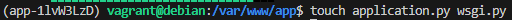
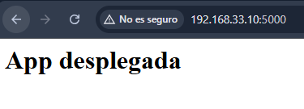
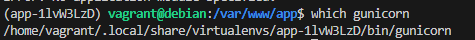
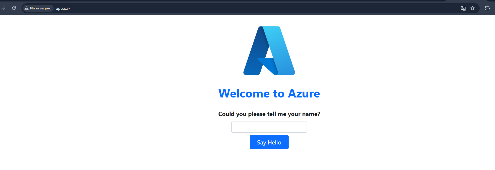

# Python-with-Flask-and-Gunicorn-application-deployment

**Author:** Alejandra Fernández López


This repository contains the deployment configuration for a Flask web application using a professional production stack on a Debian VM.
---

# Requirements

To run this project locally, you will need the following software installed:

* **Vagrant:** (v2.2+) To provision and manage the Debian-based virtual machine.
* **VirtualBox:** To act as the hypervisor for the guest operating system.
* **Python 3.9+:** The core language for the Flask web application.
* **Pipenv:** For deterministic dependency management and virtual environment isolation.
* **Nginx:** To serve as the high-performance reverse proxy.
* **Gunicorn:** As the WSGI HTTP Server to handle concurrent Python processes.
* **Git:** For version control and repository management.
---

# Project Structure

```
python-flask/
│
├── Vagrantfile             
├── config/
│   ├── assets/              
│   ├── bootstrap.sh        
│   ├── application.py      
│   ├── wsgi.py                             
│   ├── flask_app  
│   └── app.conf    
├── readme.md         
├── .env
├── .gitignore
```
---

# 1. Deployment Guide

## Important Warning
When automating this deployment via **Vagrant Provisioning**, avoid running all commands as `root`. Doing so will create the virtual environment inside the root directory, causing permission issues. Instead, use a non-privileged provision block to ensure the environment is created for the `vagrant` user.

## 1.2 Installation Steps

Follow these steps to set up the environment. Commands requiring administrative privileges are prefixed with `sudo`.

### Install Python Package Manager (pip)

Update the system repositories and install pip3:

```
sudo apt-get update && sudo apt-get install -y python3-pip
```

### Install Pipenv
Install pipenv to manage virtual environments and project dependencies:

```
pip3 install pipenv
```

Verify the installation by checking the version (ensure the binary is in your user's local path):
```
PATH=$PATH:/home/$USER/.local/bin
pipenv --version
```

### Environment Variables Support
Install python-dotenv to manage sensitive configuration and environment variables:

```
pip3 install python-dotenv
```

## 1.3 Project Directory and Permissions
Create the directory where the project will be stored. Replace msdocs-app with your specific application name:

```
sudo mkdir -p /var/www/msdocs-app
```


Since the directory was created with sudo, it is owned by root. We must change the ownership so your user owns the files, while assigning them to the www-data group (the default user for the web server):

```
sudo chown -R $USER:www-data /var/www/msdocs-app
```

Next, set the appropriate permissions to ensure the directory is readable and accessible:

```
sudo chmod -R 775 /var/www/msdocs-app
```

Inside your application directory, create a hidden file named `.env`. This file stores the necessary environment variables. Edit the file and define the entry point of your application and the execution environment:

File path: `/var/www/app/.env`

```
FLASK_APP=wsgi.py
FLASK_ENV=production
```

Now, initialize the virtual environment. Pipenv will automatically detect and load the environment variables from your `.env` file upon startup:

```
pipenv shell
```

Once executed, you will see the virtual environment name prefixed at the beginning of your shell prompt:




 This indicates that you are successfully working within the isolated environment.

 ## 1.4 Installing Dependencies
Use Pipenv to install the essential packages for our project. This ensures that both the web framework and the production server are available within our isolated environment:

```
pipenv install flask gunicorn
```

To verify the deployment, we will create a simple Flask application. We will use two separate files: `application.py` will contain the main application logic, while `wsgi.py` will act as the entry point to keep the app running in production:

```
touch application.py wsgi.py
```

## 1.5 Application Logic and Entry Point

File: `/var/www/msdocs-app/application.py`

```
from flask import Flask

app = Flask(__name__)

@app.route('/')
def index():
    '''Index page route'''
    return '<h1>App desplegada</h1>'
```

File: `/var/www/msdocs-app/wsgi.py`

```
from application import app

if __name__ == '__main__':
   app.run(debug=False)
```

## 1.6 Initial Testing (Flask Development Server)

To verify the setup, we run the application using Flask's built-in development server. By specifying the address `0.0.0.0`, we instruct the server to listen on all available network interfaces:


Once the server is running, you can access the application from your host machine (Windows) by entering the following address in your web browser: `http://IP-maq-virtual:5000`



After verifying, stop the development server by pressing `CTRL + C` in your terminal.

## 1.7 Production Server Test (Gunicorn)
Now, let's verify that Gunicorn is working correctly as our production-grade server. If the Flask development server worked, run the following command to test the application using Gunicorn with 4 worker processes:

```
gunicorn --workers 4 --bind 0.0.0.0:5000 wsgi:app
```

While still inside your virtual environment, it is crucial to identify the exact binary path where Gunicorn is executed. This path is required later to configure a Systemd service, ensuring the application runs automatically as a background process.

To find the path, run the following command: 



## 1.8 Nginx and Systemd Service Configuration

**Step 1:** Initialize Nginx

Ensure that Nginx is installed and running correctly on your system:

```
sudo systemctl start nginx
sudo systemctl status nginx
```

**Step 2:** Create the Systemd Service

Exit the virtual environment and create a service file to allow systemd to manage Gunicorn as a background process. This ensures the app starts on boot and restarts automatically if it fails.

File: `/etc/systemd/system/flask_app.service`

```
[Unit]
Description=flask app service - App con flask y Gunicorn
After=network.target
[Service]
User=vagrant
Group=www-data
Environment="PATH=/home/vagrant/.local/share/virtualenvs/app-1lvW3LzD/bin"
WorkingDirectory=/var/www/app
ExecStart=/home/vagrant/.local/share/virtualenvs/app-1lvW3LzD/bin/gunicorn --workers 3 --bind unix:/var/www/app/app.sock wsgi:app

[Install]
WantedBy=multi-user.target
```

**Step 3:** Enable the Service

Reload the systemd daemon to recognize the new service, then enable and start it:

```
sudo systemctl daemon-reload
systemctl enable flask_app
systemctl start flask_app
```

**Step 4:** Nginx Reverse Proxy Setup

Create a new configuration file for your site. This allows Nginx to act as a front-end, forwarding external traffic to the Gunicorn socket.

File: `/etc/nginx/sites-available/app.conf`

```
server {
  listen 80;
  server_name app.izv www.app.izv;

  access_log /var/log/nginx/app.access.log;
  error_log /var/log/nginx/app.error.log;

  location / {
    include proxy_params;
    proxy_pass http://unix:/var/www/app/app.sock;
  }
}
```

## 1.9 Activating the Nginx Site

To make the application live, we must create a symbolic link from the sites-available directory to the sites-enabled directory:

```
sudo ln -s /etc/nginx/sites-available/app.conf /etc/nginx/sites-enabled/
```

Verify that the link was created successfully:

```
ls -l /etc/nginx/sites-enabled/ | grep app.conf
```

Before restarting, always check the Nginx configuration for syntax errors. Then, restart the service and verify its status:

```
sudo nginx -t
sudo systemctl restart nginx
sudo systemctl status nginx
```

## 1.10 Local DNS Configuration (Hosts File)
Since we are using a custom domain (app.izv) without a real DNS server, you must map the Virtual Machine's IP address in your Host Machine's (Windows) hosts file.

File Path (Windows): `C:\Windows\System32\drivers\etc\hosts`

File Path (Linux/Mac): `/etc/hosts`

Add the following line at the end of the file (replace 192.168.X.X with your VM's actual IP).

The deployment is now complete. You can no longer access the app via a simple IP and port; it is now professionally served through Nginx. Open your browser and navigate to: http://app.izv/ 


---

# 2. Extension Task: Deploying Azure Samples

To demonstrate the scalability of this deployment process, we will replicate the entire stack using a real-world application from the Azure Samples repository.

**Step 1:** Clone the Repository

Navigate to your web directory and clone the official Flask quickstart repository:

```
cd /var/www
git clone https://github.com/Azure-Samples/msdocs-python-flask-webapp-quickstart
```

**Step 2:** Install Dependencies via Requirements

Activate the virtual environment and install the project's specific dependencies using the provided requirements.txt file:

```
pipenv install -r requirements.txt
```

**Step 3:** Production Execution with Gunicorn
For this specific application, start Gunicorn with 4 workers to handle higher traffic volumes:

```
gunicorn --workers 4 --bind 0.0.0.0:5000 wsgi:app
```

The remainder would involve proceeding exactly as we did in this practical exercise.

## 2.1 Key visual evidence demonstrating the successful execution and validation of the procedure





